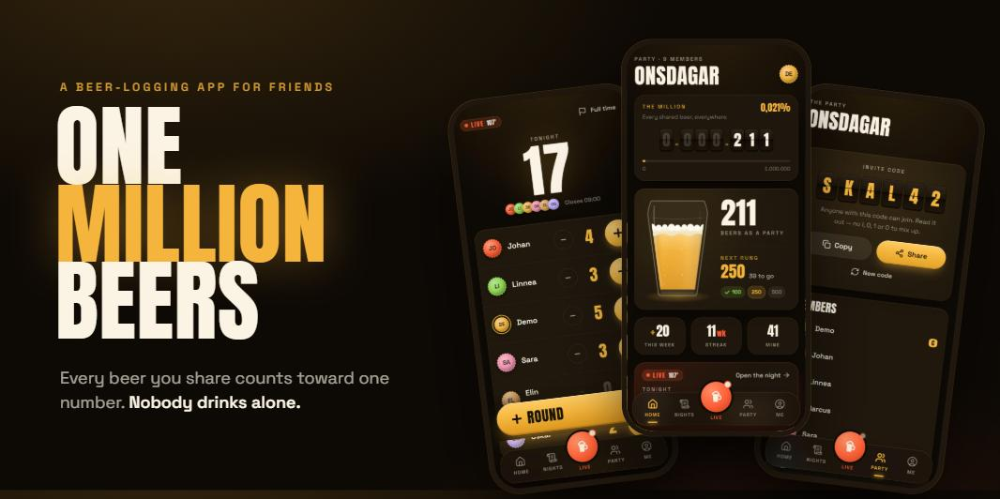
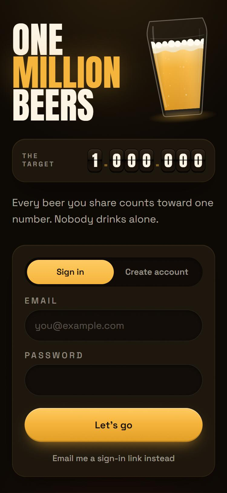
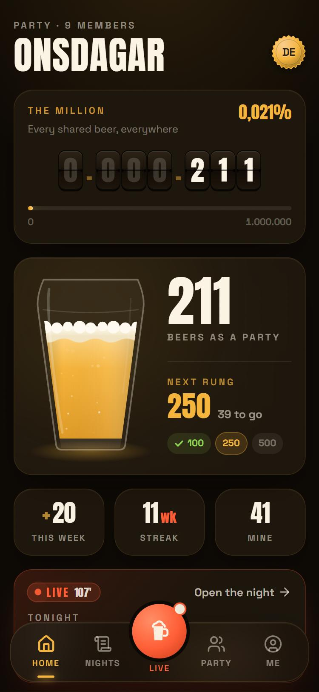
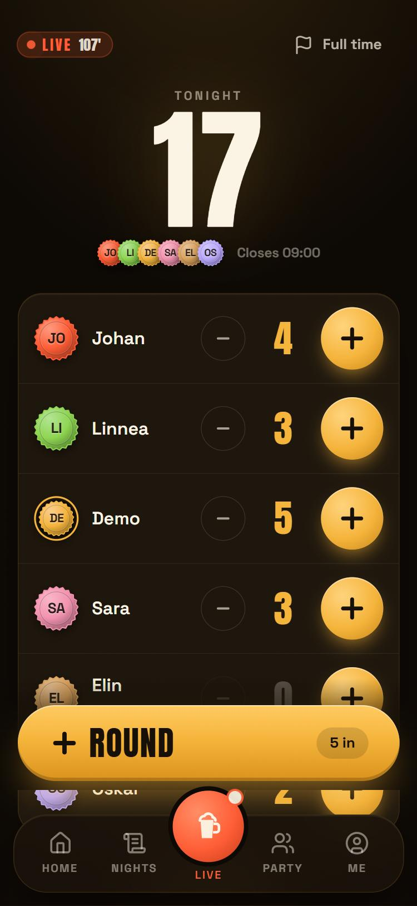
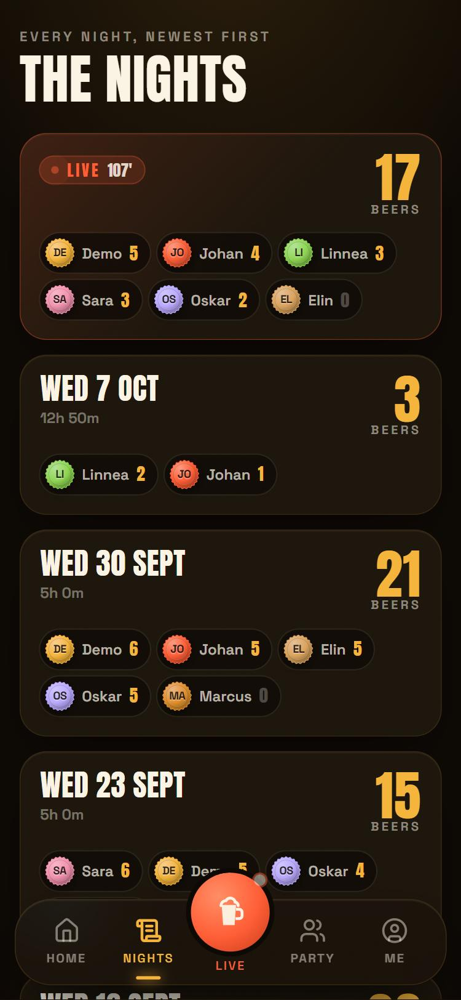
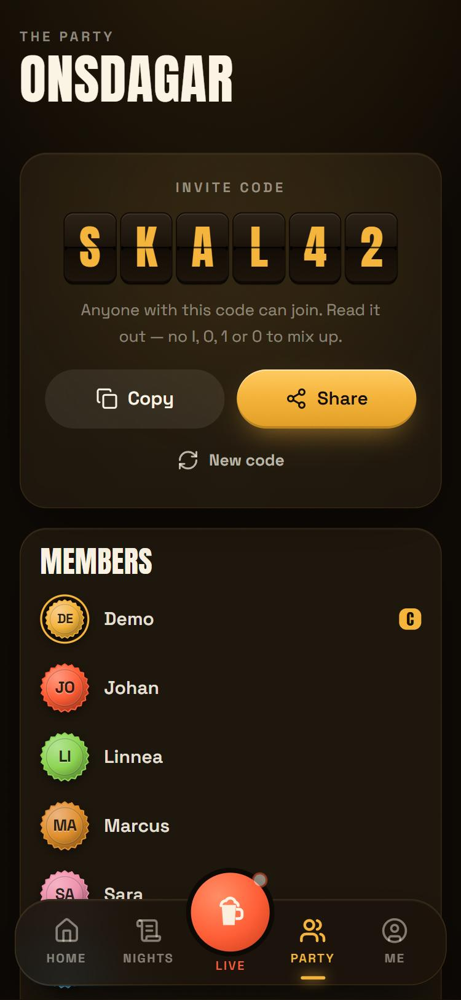

<p align="center">
  
</p>

# One Million Beers

**A beer-logging app for a group of friends, built around one absurd, shared goal:
1.000.000 beers.**

Every beer you share with your party counts toward one number on one scoreboard.
Nobody drinks alone — the app won't let you.

[What it is](#what-it-is) · [The philosophy](#the-philosophy) · [How it's built](#how-its-built) · [Run it](#run-it) · [Where it stands](#where-it-stands)

---

## What it is

Your group of friends is a **party**. When you meet up, someone kicks off a **night**,
and everyone at the table is on it. Anyone can tap **+** for anyone, or **+ ROUND** to
pour one for the whole table at once — and the tally climbs live on every phone.

Each night lands in the party's history. The party chases its next milestone on a ladder
that runs 10 → 25 → 50 → 100 → … → 1.000.000. And every beer anyone logs, anywhere, ticks
one shared global counter one step closer to seven figures.

<p align="center">
  
  
  
  
  
</p>
<p align="center"><sub>Welcome · Home · A live night · The nights · The party</sub></p>

## The philosophy

You will never drink a million beers. Nobody will. That's the joke — and the point. The
million is a number no one reaches alone and everyone moves together, so the app is about
the people at the table, not the glass in front of you.

That idea runs through every rule.

### Nobody drinks alone

The one rule the whole app is built on. A beer can only be logged at a night with at least
two people, and every one of them is a real account that joined the party with its invite
code — no guests, no names typed in. There is no way to represent drinking alone, so there
is nothing to reward it with. The database enforces this, not the interface.

The counter therefore counts **shared** beers. It undercounts reality on purpose.

### Bring a friend, not another beer

Wherever the game hands out glory, it rewards the table, not the individual. Combos — the
badges a night earns as it climbs, arriving with the game layer — count the whole table's
total and unlock for everyone there, so the route to a big badge is bringing a fifth
friend, not ordering a fifth beer. When parties band together into guilds,
the league table will rank them on achievements, not on volume.

### Rest is part of the game

Streaks count **weeks** with a night out, not days — a daily streak would reward drinking
every day and punish stopping. The designated driver keeps their streak without a single
beer. Alcohol-free beers count. A week off will earn a badge, not a guilt trip. And when notifications
arrive, they'll celebrate what happened — they will never nudge anyone to drink.

### A scoreboard, not a diary

It should feel like the scoreboard at the local on match night. The voice is a football
commentator crossed with an arcade announcer — loud, affectionate, never violent; there is
no "kill" language anywhere. Everyone is a bottle cap in their own colour. The milestone
gauge is a pint that fills toward your party's next rung. The million sits on split-flap
scoreboard tiles. A running night carries a broadcast **LIVE** badge with a match clock,
and the leaderboard is *the table*.

### One row per beer

Every beer is its own row — who drank it, who tapped it, at which night, in which party.
Nothing is a running tally. Totals, streaks, leaderboards and badges are all *derived*, so
any of them can be recomputed, reshaped or replayed over history later. That's what lets the
design stay small today without painting it into a corner — guilds included.

`−` never deletes: it voids, the beer keeps its row, and anything already celebrated stays
celebrated.

## How it's built

| | |
|---|---|
| **App** (`app/`) | React + TypeScript on Vite, Tailwind v4, shadcn/ui, TanStack Query, motion, i18next. A web app, made to live on a phone's home screen once it's hosted. |
| **Backend** (`supabase/`) | Supabase: Postgres, Auth (password or magic link) and Realtime. |
| **The rules live in the database** | Row-level security decides who sees and writes what; triggers enforce *nobody drinks alone*, keep the counters, and stamp each night's 09:00 closing time; `pg_cron` closes forgotten nights. The app can't break a rule even if it tried. |
| **Tested** | 115 assertions across five database test suites, most run as real signed-in users. The access, counter and session rules were each broken on purpose once, to prove a test catches it. |

The reasoning behind every choice — and what each one costs — is in the
[decision log](docs/DECISIONS.md).

## Run it

You need **Docker Desktop** and **Node.js 20+**. Then, from the repo:

```bash
npx supabase start            # the database, auth and realtime, in Docker
npm --prefix app install
npm --prefix app run dev      # → http://localhost:5173
```

The first start also needs a small `app/.env.local` — one command, in
[docs/LOCAL-SETUP.md](docs/LOCAL-SETUP.md) § 4½, along with testing on your phone over
Wi-Fi.

The local database comes with a demo party, **Onsdagar**, and ten Wednesdays of history.
Sign in with a demo account (logins at the top of [`supabase/seed.sql`](supabase/seed.sql)),
or create your own account and join with the invite code **`SKAL42`**.

## Where it stands

**v0 — the version for one group of friends — is running locally.**

- ✅ Sign-up, profiles, creating and joining a party
- ✅ The live night: kick-off, `+`, `+ ROUND`, `−`, the designated driver, late arrivals, full time
- ✅ The global counter, the party's milestone pint, weekly streaks, the table, the nights
- ✅ Live updates on every phone in the party
- ⏳ **Next:** the game layer — badges, combos and milestone celebrations
- ⏳ The offline queue, for taps in a pub with no signal
- ⏳ Hosting, so friends can install it from a link
- 💤 Guilds — designed for, deliberately parked

## Words

| Term | Means |
|---|---|
| **Party** | Your group of friends. Joined with an invite code. |
| **Night** | One evening out, inside a party — a *session* in the code. Needs two people before anyone can log. |
| **Round** | One tap that adds a beer for everyone at the table who isn't driving. |
| **The ladder** | The milestones every party climbs: 10, 25, 50, 100 … 1.000.000. |
| **Guild** | Many parties under one banner, like a supporters' club. Later. |

## The docs

| Document | What it covers |
|---|---|
| [docs/LOCAL-SETUP.md](docs/LOCAL-SETUP.md) | Getting it running, including on your phone |
| [docs/DECISIONS.md](docs/DECISIONS.md) | Every decision, why, and what it costs |
| [docs/ARCHITECTURE.md](docs/ARCHITECTURE.md) | Data model, counters, the achievement engine, security |
| [docs/ROADMAP.md](docs/ROADMAP.md) | What v0 includes, and why so little is irreversible |
| [docs/ACHIEVEMENTS.md](docs/ACHIEVEMENTS.md) | The badge catalogue — football and gaming references |
| [docs/USER-JOURNEYS.md](docs/USER-JOURNEYS.md) | Journey flowcharts and the story map |
| [docs/QUESTIONS.md](docs/QUESTIONS.md) | Open questions, and the owner's answers |
| [docs/SESSION-HANDOFF.md](docs/SESSION-HANDOFF.md) | Notes from the session that designed it |

## Design language

Dark, warm, the terrace meets the arcade cabinet. Numbers are the hero.

| Token | Hex | Use |
|---|---|---|
| Stout Black | `#161009` | Background |
| Cask Brown | `#1D160D` | Cards — the beer mats |
| Gold | `#F5B23A` | The beer, progress, the main action |
| Fire | `#FF5B35` | Live nights, hot streaks |
| Hop Green | `#8BD450` | Unlocked, done |
| Foam | `#FBF4E4` | Text |

Type: **Anton** for scoreboard numbers and headlines, **Space Grotesk** for everything else.
