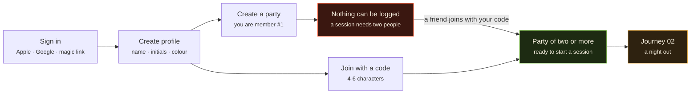
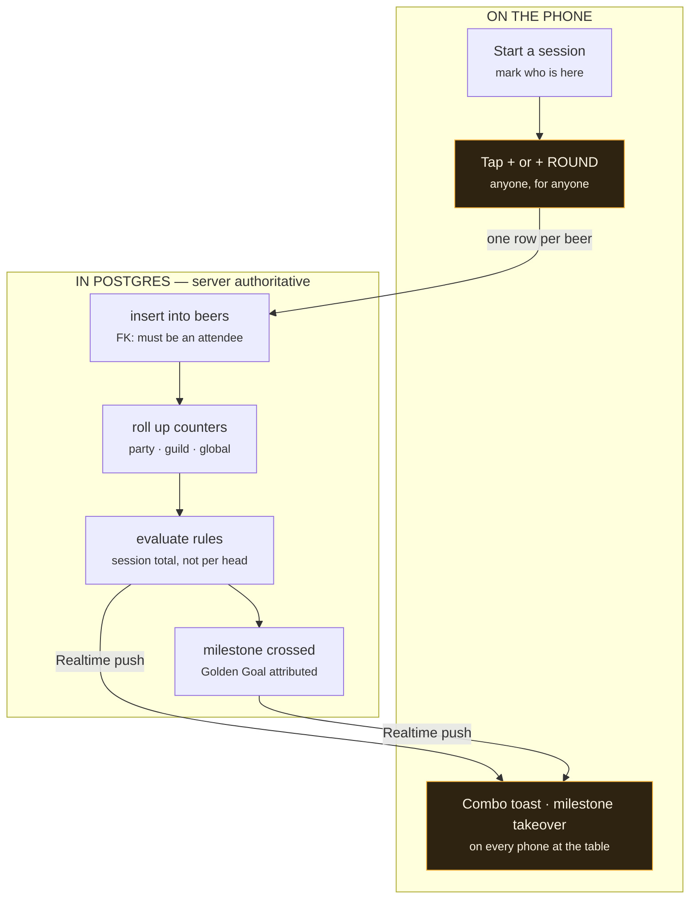

# User journeys & story map

Visual version: **https://claude.ai/artifact/4LTZV3XhUSWHSDc2rFp8jE**

The diagrams below are Mermaid, so they render on GitHub. Codes in brackets are roadmap
IDs from [ROADMAP.md](ROADMAP.md).

---

## Journey 01 — First run, and the cold start

Two ways in, and they are **not symmetric**. Joining an existing party works immediately.
Founding one leaves you unable to log anything at all.

**The founder's path dead-ends.** Because a session requires two attendees
([D19](DECISIONS.md#d19--no-solo-logging)) and every attendee must be a real account that
joined the party by code
([D22a](DECISIONS.md#d22a--joining-a-party-requires-an-invite-code-supersedes-d22)), the
person who creates a party cannot log a single beer until someone else accepts.

That red box is not an error state — it is the designed consequence of the Party Rule, and
it is the first thing every new user sees. It is also why all three v1 stories in the
"Form a party" column are load-bearing.

---

## Journey 02 — A night out

The phone only ever says *"a beer happened"*. Everything that decides what that means runs
in Postgres and comes back over Realtime.

**Why the celebration is a round trip.** The client never claims a badge — it inserts a
beer and waits. That is what keeps a public, competitive counter honest
([D7](DECISIONS.md#d7--achievements-are-data-not-code)), and what lets a toast land on all
five phones at once instead of only the one that tapped.

Two details that live here:

- The session closes manually, or auto-closes at **06:00 local**
  ([D27](DECISIONS.md#d27--sessions-auto-close-at-0600-local)). Then the feed entry
  publishes and combos finalise.
- A `−` tap **voids** the most recent beer: counters fall, the audit trail stays, and
  badges are never taken back
  ([D28](DECISIONS.md#d28-----is-a-soft-delete-milestones-attribute-by-counter-crossing)).

---

## Journey 03 — A pub with no signal

The normal case, not the edge case. Which means the celebration sometimes arrives after you
have left.

```mermaid
flowchart LR
  A["Tap +, no signal<br/><small>tally moves instantly</small>"] -->|optimistic| B["Queued locally<br/><small>tagged with a client_uuid</small>"]
  B -.->|on reconnect| C["Replayed to Postgres<br/><small>rounds replay as one unit</small>"]
  C --> D["Toast fires in the taxi<br/><small>ON FIRE, twenty minutes late</small>"]
  C --- E["unique&#40;client_uuid&#41;<br/><small>a double send is a no-op, not a double count</small>"]

  classDef gold fill:#2e2210,stroke:#F5B23A,color:#FBF4E4
  classDef good fill:#1d2b12,stroke:#8BD450,color:#FBF4E4
  class B gold
  class D good
```

**Idempotency is the whole trick.** Without the unique key on `client_uuid`, a flaky
reconnect double-counts the round and the global number becomes a lie. With it, replay is
free and the queue can retry as often as it likes
([D8](DECISIONS.md#d8--offline-first-in-phase-1)).

---

## Story map

Backbone reads left to right as the order a person actually meets the app. Each cell holds
the stories that make that step work, grouped by release.

| | 01 Get in | 02 Form a party | 03 Start a night | 04 Log beers | 05 Celebrate | 06 Track progress | 07 Compete |
|---|---|---|---|---|---|---|---|
| **v1** Phase 0+1 & game layer | **Sign in** — Apple, Google, magic link `C1` Pick name, initials, colour `C1` | **Create a party** `C2` **Share the invite code** `C2` **Join with a code** `C2` | **Start a session** `C10` Mark who is here `C3` Close it, or 06:00 auto-close `C10` | **Tap + for one person** `C3` **Tap + ROUND for everyone** `C3` Skip the driver on rounds `C3` Tap − to fix a mistake `C3` **Log with no signal** `C8` | **Live combo toasts** `G4` **Milestone takeover, Golden Goal named** `G5` Tally climbs on every phone `C11` Rules engine + catalogue `G1` `G2` | **Milestone ring + 1M bar** `C5` Week, streak, rank tiles `C5` Party leaderboard `C6` Activity feed `C7` Global counter ticking `C4` | *nothing in v1 — competition needs a population first* |
| **Next** Phase 4 | Onboarding polish, empty states `P6` | Captain can rename/remove `Q25` Leave a party, history stays `Q25` | Set the venue `S4` Save the regular haunts `S4` | Add volume, ABV, type `S5` Add a photo `S3` | Push when the party logs `S1` React to feed items `S2` | Achievements grid `G3` Streaks + weekly recap `S6` Easter-egg rungs `G6` | — |
| **Guilds** Phase 3 | — | Party joins one guild `U1` Open/approval/invite `Q3` | — | — | Guild-scoped badges `U6` | Guild dashboard + gauge `U4` | **Browse and search guilds** `U2` **League table, ranked on points** `U5` Seeded club catalogue `Q6` Seasons, silverware `Q24` |
| **Later** Phase 5 | Age gate, 17+ rating `P4` | Several parties + switcher `D17` | Backdate last night `D16` | Rate limits, outlier flagging `P1` | Announcer sound, muted `G7` | Public counter page `P2` Home-screen widget `P3` | Transfer window `U7` |

**Bold** = load-bearing, the walking skeleton. `Qnn` = waiting on an
[open question](QUESTIONS.md).

---

## What the map makes obvious

**Column 07 is empty in v1.** Guilds are the tier that makes rungs above 5.000 reachable,
and they carry the league table that makes achievement points mean anything
([D14](DECISIONS.md#d14--achievement-points-rank-the-guild-league-table)). For the whole of
v1 the top half of the ladder is unreachable and the points have no scoreboard. That is
the right sequencing — competition needs a population first — but it means **v1 is a
smaller promise than the pitch**, and worth saying out loud when you show it to people.

**Column 02 carries the cold start.** Three v1 stories, all load-bearing, and Journey 01
shows why: get the invite flow even slightly wrong and every new user lands in the red box
with nothing to do.

**Five open questions sit inside v1's own schema.** Q21, Q22, Q23, Q25 and Q26 all land in
`F4`, so they are cheapest to settle before the first migration runs.
